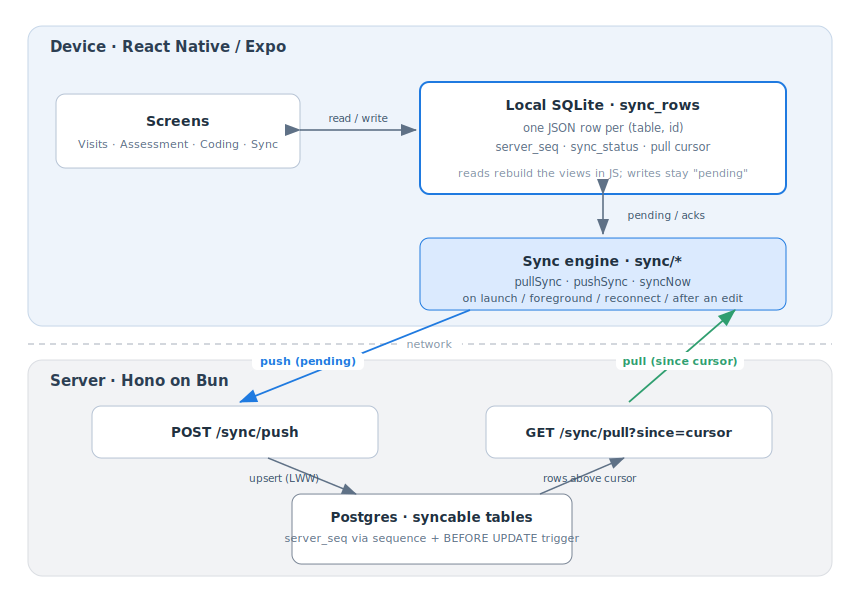
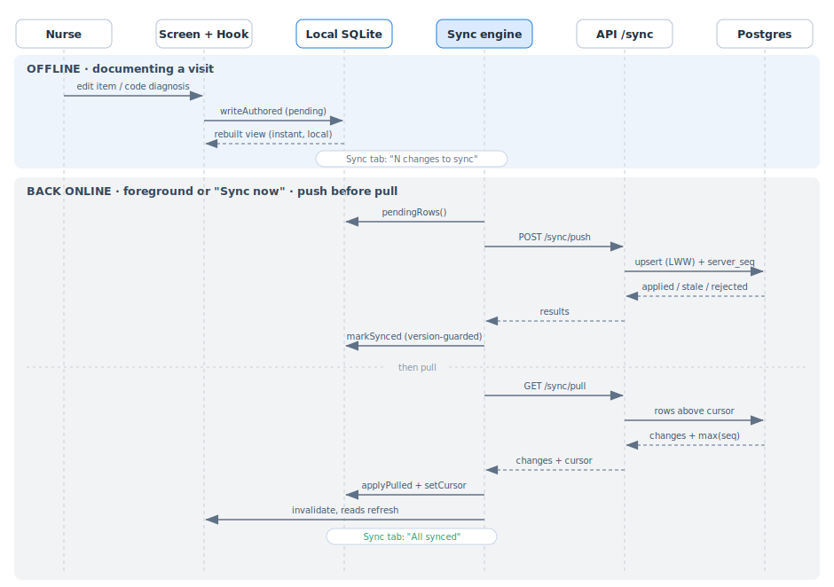

# Offline sync architecture

How the app keeps working with no signal and catches up when a connection returns.

It rests on two fields that do different jobs:

| Field | Set by | Job |
| --- | --- | --- |
| `updatedAt` | the device (wall clock) | conflict tiebreak: last write wins per row |
| `serverSeq` | the server (a Postgres sequence) | pull cursor: "what has the server seen since N?" |

## Components

Screens never touch the network. They read and write a local SQLite mirror, and a background sync
engine reconciles that mirror with the server over two endpoints.

- **Data-access seam.** Screens and hooks call functions like `localVisits` and `saveAnswerLocal`
  instead of calling `fetch` themselves. That's why we could point those functions at local SQLite
  instead of the API without changing a single screen.
- **Row store.** `sync_rows` keeps each row as JSON keyed by `(table, id)`, plus `server_seq`,
  `updated_at`, `deleted_at`, and a device-only `sync_status`. The views are rebuilt in JS rather than
  mirrored into typed tables, since the data is small and it keeps the pull-apply to one function that
  works for any table.
- **Online-only actions** don't use any of this. Creating an assessment, filing (the PDGM snapshot),
  audio transcription, and AI suggestions all need the server, so they talk to it directly.

## The sync lifecycle

Document offline, reconcile on reconnect. Push runs before pull, so the server has the latest before
it sends anything back.

The version-guarded ack: `markSynced` only clears `pending` for the exact `updatedAt` that was
pushed. If the nurse edits a row mid-flight its `updatedAt` moves on, the guard misses, and the row
stays `pending` and re-pushes next round, so an in-flight edit is never dropped.

## Map to the code

| Concern | Where |
| --- | --- |
| Local store, cursor, acks | `apps/mobile/src/db/sqlite.ts` |
| Read views | `apps/mobile/src/db/views.ts` |
| Local edits | `apps/mobile/src/db/writes.ts` |
| Sync engine | `apps/mobile/src/sync/` |
| Triggers | `apps/mobile/src/hooks/use-sync-triggers.ts` |
| Sync surface | `apps/mobile/src/app/(tabs)/sync.tsx`, `apps/mobile/src/db/sync-status.ts` |
| Server endpoints | `apps/api/src/sync.ts`, `apps/api/src/index.ts` |
| Wire contract | `packages/shared/src/sync.ts` |
| `server_seq` machinery | `packages/db/src/schema/columns.ts` |

## Scope

- **Client-authored (push + pull):** `assessment_answers`, `diagnosis_codings`, the nurse's offline edits.
- **Pull-only (hydrated for offline reads):** `visits`, `patients`, `diagnoses`, `assessments`,
  `answer_suggestions`, `diagnosis_suggestions`.
- **Online-only:** assessment create, filing + PDGM snapshot, audio transcription, AI suggestions.
